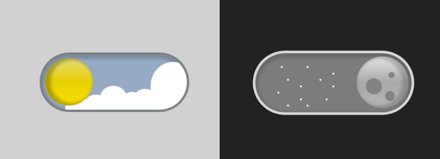

# Day & Night Switch
<p align="center">
  <a href="https://night-day.netlify.app/" >
    Ver projeto
  </a>
</p>
<p align="center">
  
</p>

Este projeto é um **card interativo** que alterna entre **modo dia** e **modo noite** com animações do sol, lua, nuvens e estrelas.

O objetivo é mostrar como usar CSS, JavaScript e HTML para criar uma interface visual animada e interativa, que também pode ser integrada facilmente em outros sites.

---

## 🚀 Funcionalidades
- Sol desliza pela tela girando.
- Lua entra pela direita com rotação.
- Nuvens sobem suavemente no modo dia.
- Estrelas aparecem no modo noite.
- Texto e cores do container mudam de acordo com o tema.

---

## 🖥️ Tecnologias Utilizadas
- **HTML5**: estrutura do card e elementos visuais.
- **CSS3**: transições, animações, cores e posicionamento.
- **JavaScript (Vanilla)**: alternância entre os modos dia/noite e controle de cooldown.

---

## 📂 Estrutura do Projeto
```
/index.html        # Arquivo HTML principal
/style.css         # Estilos e animações
/script.js         # Funções de alternância de tema
```

---

## 🎮 Como Implementar

1. Clone ou baixe o repositório:
```bash
github.com/YuReN31/day-night-switch.git
```

2. Abra o arquivo `index.html` no navegador.

3. Clique no card para alternar entre **dia** e **noite**.

4. Se quiser integrar em outro site:
   - Copie o HTML do `<div id="main">...</div>` para o seu projeto.
   - Importe o `style.css` e `script.js`.
   - Para redimensionar o card sem mexer nos tamanhos internos, use `transform: scale(0.8)` no container.

```css
div#main {
    transform: scale(0.8);
}
```

Isso mantém todas as proporções e animações.


## Autor
Feito por **YuReN31_** .

